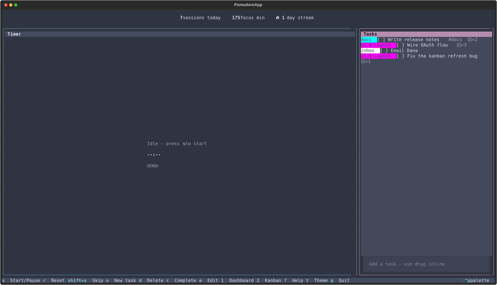

# pomban

[](https://www.python.org/)
[](./LICENSE)
[](https://github.com/prajwalmahajan101/pomban/actions/workflows/test.yml)

> A local-first personal productivity platform — projects, sprints,
> kanban, and focus sessions — that runs entirely in your terminal.



```bash
pipx install pomban && pomban
```

## What is pomban?

pomban is a single-binary planning, focus, and review platform built
around one SQLite library on your machine. It models work the way you
actually do it — projects own sprints, sprints own tasks, tasks
accumulate focus sessions — and gives every layer a keyboard-driven
screen:

- **Plan** at the project and sprint level. Move tasks across a
  kanban with WIP limits, deadlines, and inline `@project` /
  `!sprint` syntax.
- **Focus** with a Pomodoro engine that logs every session against a
  task, captures mid-session blockers, and records a free-text note
  when a session ends.
- **Review** with stats, per-tag analytics, a daily digest, exports
  (CSV / JSON / grouped markdown), and a full session history.
- **Integrate** through phase-lifecycle shell hooks and in-process
  Python plugins. The first-party `git_sync` plugin commits the
  SQLite library on exit so the same database follows you across
  machines via a personal git remote.

The terminal is the runtime — fast launch, zero chrome, every action
one keystroke — but the product is the platform underneath. Your
library never leaves your machine, no account, no telemetry, no cloud.

### How it compares

- **vs CLI timers** — full task surface (kanban + projects + sprints
  + digest + stats + history), not just a countdown.
- **vs phone Pomodoro apps** — keyboard-driven, distraction-free,
  themed, runs in the terminal you already have open.
- **vs PM SaaS (Linear/Jira/Notion)** — local-first, single-file
  library you own, no login, no rate limits, no migration anxiety.
- **vs a wall clock + sticky notes** — every session is logged. Per
  task, per project, per sprint, per day, per week.

## Features

### Plan

- **Projects and Sprints** (`5` / `6`) — full CRUD with archiving,
  completion states, and `@project` / `!sprint` inline task syntax.
  One sprint per project can be active; sprint runner overlay
  (`Shift+R`) keeps the current goal pinned regardless of screen.
- **Kanban board** (`2`) — three columns, priorities, due dates
  (overdue render red), per-column WIP limits, board search (`/`),
  visual-mode bulk actions (`v`), card-detail screen (`i`).
- **Context header** — every screen carries the active project /
  sprint chip so you always know what work the next focus session
  attaches to.
- **First-run flow** — empty DB launches a modal that seeds your
  first project so the hierarchy is never empty.

### Focus

- **Pomodoro engine** — focus / short-break / long-break / lunch
  phases, configurable cycle length, auto-advance toggle (`Shift+T`),
  resume-on-restart prompt, lunch-window suggestion.
- **Blocker capture** (`b`) — log a one-line blocker against the
  current focus session without breaking the timer.
- **Session notes** — at session end, jot a freeform note; it
  surfaces on the history screen against that row.
- **Working-hours quiet** — set a daily window in `[breaks]` and
  outside it desktop popups + sound suppress automatically. A
  header chip shows the current state.

### Review

- **Stats** (`3`) — daily / weekly / monthly buckets, top tasks,
  interruption counts, plus a **per-tag analytics panel** built on
  `minutes_per_tag`.
- **Today digest** (`7`) — sessions, top tasks, interruptions for
  the current day, one screenful.
- **History** (`4`) — every session with planned vs. actual
  duration and the session note inline.
- **Exports** — `pomban export` ships CSV, JSON, and
  grouped-markdown formats. `pomban sprint export …` produces a
  per-sprint report.

### Integrate

- **Hooks** — `[hooks].on_focus_start` / `on_focus_end` /
  `on_break_start` / `on_break_end` shell commands invoked with
  `POMODORO_PHASE` and `POMODORO_TASK_TITLE` env vars.
- **In-process plugins** — Python entry points discovered at
  startup; exceptions are sandboxed and never crash the app.
- **`git_sync` plugin** — commits the SQLite library on exit so it
  can sync across devices via a personal git remote.
- **Themes** — nord, gruvbox, dracula, catppuccin-mocha,
  tokyo-night. Cycle with `t`; persisted to `config.toml`.

## Install

```bash
pipx install pomban
```

`pipx` (or [`uv tool`](https://docs.astral.sh/uv/)) is the
recommended path for end-user CLI tools — it sandboxes pomban's
dependencies in their own venv and gives you a global `pomban`
command. On modern Linux distros it's also the only path that works
without virtualenv gymnastics, thanks to
[PEP 668](https://peps.python.org/pep-0668/).

```bash
# uv tool — same idea, faster
uv tool install pomban

# pip (inside a venv)
python -m venv .venv && source .venv/bin/activate
pip install pomban

# From source
git clone https://github.com/prajwalmahajan101/pomban
cd pomban && pip install -e ".[dev]"
```

### Requirements

- Python ≥ 3.11
- A terminal with at least 80 columns. 100+ recommended.
- Linux desktop notifications need `notify-send`; sound needs
  `paplay`, `aplay`, or `ffplay` on `$PATH`. Both degrade silently
  if missing — the in-TUI bell still fires.

## Quick start

```bash
pomban                    # launch the TUI
```

On an empty database the first-run modal walks you through creating
a project. From there: pick a sprint, add tasks (`n`, with inline
`@project` / `!sprint` / `#tag` / `~25` for a 25-minute estimate),
and hit `s` to start a focus session.

Press `?` at any time for a context-aware help overlay. The most
common keys:

| Key | Action |
|---|---|
| `s` / `Space` | Start / pause / resume the timer |
| `r` | Reset |
| `Shift+S` / `S` | Skip to the next phase |
| `n` | Focus the "new task" input |
| `b` | Log a blocker against the current focus session |
| `1`–`7` | Jump to Dashboard / Kanban / Stats / History / Projects / Sprints / Today |
| `Shift+R` | Sprint runner overlay |
| `t` | Cycle theme |
| `?` | Help overlay |
| `q` | Quit (persists pending focus session) |

Full reference: [docs/site/keybindings.md](docs/site/keybindings.md).

### CLI

```bash
pomban                                # launch the TUI
pomban export --since 7d              # markdown review to stdout
pomban export --since 7d --format csv # CSV export
pomban export --since 7d --format json
pomban sprint export …                # per-sprint reports (see `--help`)
```

## Configuration

pomban reads `~/.config/pomban/config.toml` (XDG-compliant). The
file is optional — sane defaults ship. Top-level sections:

| Section | What it controls |
|---|---|
| `[timer]` | Focus / break minutes, cycle count, warning seconds, auto-advance |
| `[notifications]` | Desktop / sound / bell |
| `[ui]` | Theme |
| `[hooks]` | Shell commands on phase start / end |
| `[sync]` | The `git_sync` plugin |
| `[breaks]` | Lunch-break window + working-hours quiet window |
| `[kanban]` | Per-column WIP limits |
| `[[preset]]` | One block per preset, switchable via `p` |

The working-hours window lives under `[breaks]` as
`working_hours_start` / `working_hours_end` (`"HH:MM"`); outside the
window, desktop popups and sound suppress (the in-TUI bell still
fires).

Full reference: [docs/site/configuration.md](docs/site/configuration.md).

### XDG paths

| Purpose | Path |
|---|---|
| Config | `$XDG_CONFIG_HOME/pomban/config.toml`, default `~/.config/pomban/config.toml` |
| Library DB | `$XDG_DATA_HOME/pomban/pomban.db`, default `~/.local/share/pomban/pomban.db` |
| Log | `$XDG_STATE_HOME/pomban/pomban.log`, default `~/.local/state/pomban/pomban.log` |

## Troubleshooting

**The bell rings but no desktop notification appears.**
On Linux, install a notification daemon and `notify-send` (`libnotify`
on most distros). On macOS, install `terminal-notifier`. The bell
itself always fires; the desktop notification is best-effort.

**Notifications stay quiet during the day.**
Check your `[breaks].working_hours_start` / `working_hours_end`. The
header chip reflects the current quiet state.

**`git_sync` complained "not a git repo".**
Run `git init && git remote add origin <your-url>` inside
`~/.local/share/pomban/`. pomban commits on exit but never
pushes — set up a `post-commit` hook or cron if you want auto-push.

**A focus session crashed mid-pomodoro; will I lose it?**
No. The session and remaining seconds are persisted at every phase
transition. On next launch you'll get a resume prompt.

**SQLite says "database is locked".**
pomban uses a single SQLite connection by design (see
[ADR-0002](docs/adr/0002-single-sqlite-connection.md)). If you opened
the DB in another tool while pomban was running, close that tool.

## Development

```bash
git clone https://github.com/prajwalmahajan101/pomban
cd pomban
python -m venv .venv && source .venv/bin/activate
pip install -e ".[dev]"
pre-commit install

pytest -q
ruff format --check . && ruff check src/ tests/
```

See [CONTRIBUTING.md](./CONTRIBUTING.md) for the full convention list,
[ROADMAP.md](./ROADMAP.md) for what's coming, and
[RELEASE_PLAN.md](./RELEASE_PLAN.md) for how releases are cut.

## Project background

pomban is a solo, phase-driven project. The phase plan and current
status are in [ROADMAP.md](./ROADMAP.md); architectural decisions are
recorded under [docs/adr/](docs/adr/); the cumulative change history
is in [CHANGELOG.md](./CHANGELOG.md). Active and resolved code-review
findings live under [`.code_review/`](.code_review/).

## License

MIT — see [LICENSE](./LICENSE).
